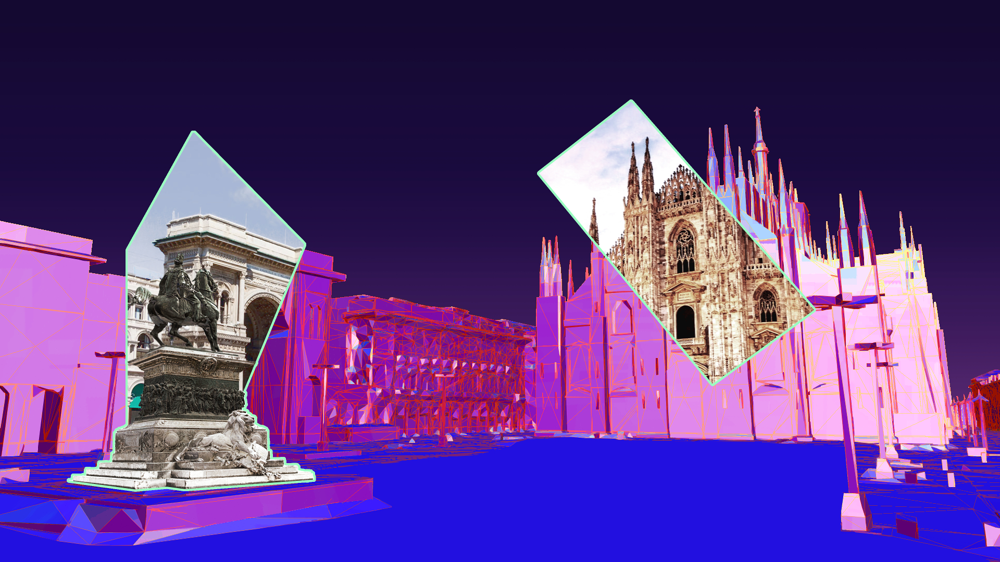
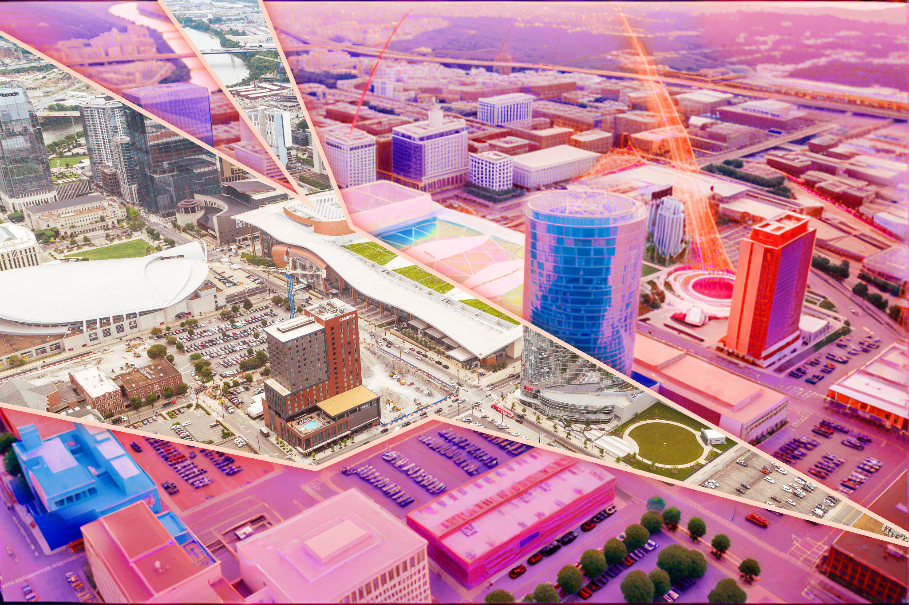
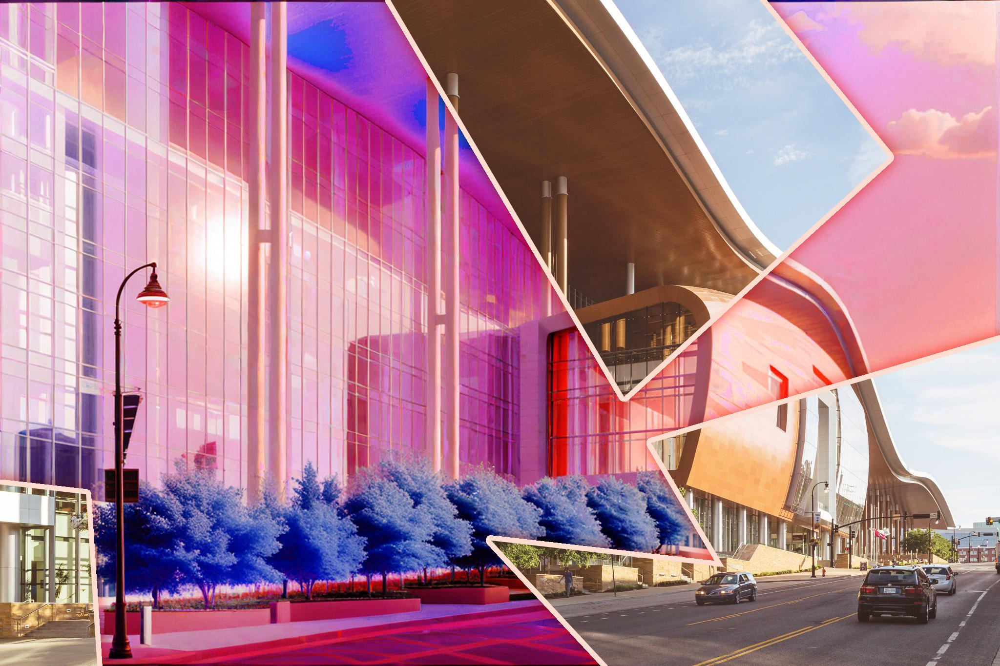

Website for the Computer Vision for Metaverse Workshop - CV4Metaverse, from 2024 to 2025.
{style="color: gray; font-size: smaller;"}

<!--more-->

**<mark>Website</mark>** · [https://sites.google.com/view/cv4metaverse-2024](https://sites.google.com/view/cv4metaverse-2024)  
**<mark>Website</mark>** · [https://sites.google.com/view/cv4metaverse-2025](https://sites.google.com/view/cv4metaverse-2025)  
**<mark>Tools</mark>**
· **google sites**
· **html**
· **css**

I've been part of the organizers of the CV4Metaverse workshop in [2024](https://sites.google.com/view/cv4metaverse-2024/organizers) and [2025](https://sites.google.com/view/cv4metaverse-2025/organizers). I've developed and maintained the official websites together with [Ali Abdari](https://aliabdari.github.io/).

I've also had some fun creating the graphics for the websites. In particular, the banner images of the websites feature landmarks of the cities where the workshop was held, Milan and Nashville.

For Milan, I combined [a wireframe 3D model of the Milan Cathedral](https://sketchfab.com/3d-models/milan-cathedral-1bcbcd5885f74d1990ddb6cd3edce4e1) (edited with a lot of Gimp) and real photos of the same location, to give the impression of the real world poking into a "metaverse" scene. 

For Nashville, I wanted to do a similar thing, but I could not find an open-access 3D model of the Nashville Music City Center. So, I used [OpenArt](https://openart.ai/features/style-transfer) to perform style transfer on two photos of the building and city, giving them a "neon" and "cyberpunk" look. Finally, like with Milan, I combined the original and edited pictures to bridge the two worlds (again, with a lot of Gimp inbetween).

